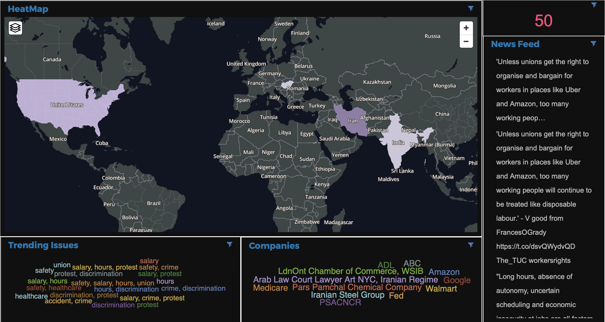

# Analyzing Employee Sentiment from Tweets using Watson Studio

### Introduction:
This project walks you through how to obtain tweets related to workplace issues in realtime, then analyze and display them with Watson tools. It is a walkthrough of the entire project including narrowing your results to relevant non-positive tweets with Python, and creating custom natural language understanding models that shape your analysis of the data.

### Tools Used:
- Twitter API / Twitter Developer Account (Optional)
- Watson Studio
- Jupyter Notebooks
- Watson Discovery
- Watson Knowledge Studio
- Cognos Dashboard

